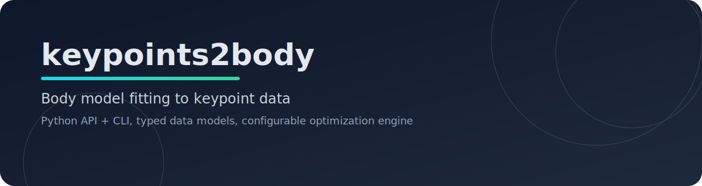

keypoints2body Documentation
=========================

`keypoints2body` is a Python library for fitting SMPL-family body models (SMPL/SMPLH/SMPLX)
to 3D joints from single frames or motion sequences.

.. toctree::
   :maxdepth: 2
   :caption: User Guide

   getting_started
   usage
   cli
   architecture
   contributing

.. toctree::
   :maxdepth: 2
   :caption: API Reference

   api

Indices and tables
------------------

* :ref:`genindex`
* :ref:`modindex`
* :ref:`search`
